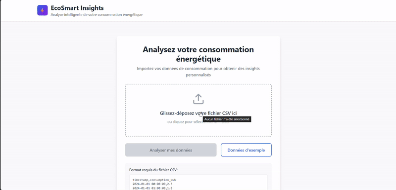

# 🌱⚡ EcoSmart Insights

**Plateforme d'analyse et prédiction de la consommation énergétique domestique utilisant le Data Mining**

Application web full-stack qui permet d'analyser, prédire et optimiser la consommation énergétique grâce à des algorithmes de Machine Learning avancés.


---

## 📋 Table des Matières

- [Présentation](#-présentation)
- [Fonctionnalités](#-fonctionnalités)
- [Algorithmes de Data Mining](#-algorithmes-de-data-mining)
- [Technologies Utilisées](#-technologies-utilisées)
- [Installation](#-installation)
- [Utilisation](#-utilisation)
- [Structure du Projet](#-structure-du-projet)
- [Captures d'Écran](#-captures-décran)
- [API Endpoints](#-api-endpoints)

---

## 🎯 Présentation

EcoSmart Insights est une application web intelligente développée dans le cadre du **Mini-Projet Data Mining (3DNI - 2025)** qui permet aux utilisateurs de :

- 📊 **Analyser** leur consommation énergétique détaillée
- 🔮 **Prédire** leur consommation future sur 7 jours
- 🎯 **Classifier** leur profil de consommation (Économe, Moyen, Élevé, Irrégulier)
- ⚠️ **Détecter** les anomalies et pics inhabituels
- 💡 **Recevoir** des recommandations personnalisées d'économie d'énergie

---

## ✨ Fonctionnalités

### 1. Upload et Validation de Données
- Import de fichiers CSV avec validation automatique
- Génération de données d'exemple pour démonstration
- Support du drag & drop

### 2. Analyse de Profil (Classification)
- Classification automatique en 4 profils de consommation
- Comparaison avec les moyennes nationales
- Analyse des caractéristiques de consommation

### 3. Détection d'Anomalies (Isolation Forest)
- Identification des pics de consommation inhabituels
- Calcul des écarts en pourcentage
- Suggestions de causes probables

### 4. Analyse des Patterns Temporels
- Graphiques de consommation horaire
- Identification des heures de pointe
- Recommandations d'heures creuses

### 5. Prédictions (Random Forest)
- Prédiction sur 7 jours avec granularité horaire
- Estimation des coûts futurs
- Graphiques de tendances

### 6. Recommandations Personnalisées
- Conseils adaptés au profil utilisateur
- Estimation des économies potentielles
- Priorisation des actions (Haute/Moyenne/Basse)

---

## 🧠 Algorithmes de Data Mining

### 1. **Classification Basée sur Règles**
```python
# Profil de consommation basé sur la moyenne et variance
if avg_consumption < 4.0:
    profil = "Économe"
elif avg_consumption < 6.0:
    profil = "Moyen"
elif std_consumption < 2.0:
    profil = "Élevé"
else:
    profil = "Irrégulier"
```

### 2. **Isolation Forest** (Détection d'Anomalies)
```python
IsolationForest(
    contamination=0.05,  # 5% d'anomalies attendues
    random_state=42
)
```

### 3. **Random Forest Regressor** (Prédiction)
```python
RandomForestRegressor(
    n_estimators=50,
    max_depth=10,
    random_state=42
)
```

### 4. **Analyse de Séries Temporelles**
- Moyenne mobile sur 24h
- Détection de patterns horaires et hebdomadaires
- Feature engineering temporel

---

## 🛠️ Technologies Utilisées

### Backend
- **Flask 3.0** - Framework web Python
- **Pandas 2.1** - Manipulation de données
- **Scikit-learn 1.3** - Algorithmes de Machine Learning
- **NumPy 1.26** - Calculs numériques

### Frontend
- **React 18.2** - Interface utilisateur
- **Vite 5.0** - Build tool rapide
- **Tailwind CSS 3.4** - Framework CSS
- **Recharts 2.10** - Visualisations de données
- **Axios 1.6** - Requêtes HTTP

### Data Mining
- **Classification** - Profiling utilisateur
- **Isolation Forest** - Détection d'anomalies
- **Random Forest** - Prédiction de séries temporelles
- **Feature Engineering** - Extraction de caractéristiques temporelles

---

## 🚀 Installation

### Prérequis

- **Python 3.11+** installé
- **Node.js 18+** et npm installés
- **Git** installé

### 1. Cloner le Repository
```bash
git clone https://github.com/votre-username/ecosmart-insights.git
cd ecosmart-insights
```

### 2. Installation du Backend
```bash
# Aller dans le dossier backend
cd backend

# Créer un environnement virtuel
python -m venv venv

# Activer l'environnement virtuel
# Windows
.\venv\Scripts\activate
# Linux/Mac
source venv/bin/activate

# Installer les dépendances
pip install -r requirements.txt
```

### 3. Installation du Frontend
```bash
# Aller dans le dossier frontend
cd ../frontend

# Installer les dépendances
npm install
```

---

## 💻 Utilisation

### Démarrer le Backend
```bash
# Dans le dossier backend avec venv activé
cd backend
.\venv\Scripts\activate  # Windows
python app.py
```

Le backend sera accessible sur **http://localhost:5000**

### Démarrer le Frontend
```bash
# Dans un nouveau terminal, dossier frontend
cd frontend
npm run dev
```

Le frontend sera accessible sur **http://localhost:5173**

### Utiliser l'Application

1. **Ouvrir** http://localhost:5173 dans votre navigateur
2. **Cliquer** sur "Données d'exemple" pour tester rapidement
3. **OU** uploader votre propre fichier CSV au format :
```csv
timestamp,consumption_kwh
2024-01-01 00:00:00,2.3
2024-01-01 01:00:00,1.8
2024-01-01 02:00:00,1.6
...
```

4. **Explorer** le dashboard avec toutes les analyses

---

## 📁 Structure du Projet
```
ecosmart-insights/
├── backend/
│   ├── models/
│   │   ├── __init__.py
│   │   ├── data_mining.py          # Algorithmes ML
│   │   └── preprocessing.py        # Traitement des données
│   ├── data/
│   │   └── generate_sample_data.py # Génération de données test
│   ├── utils/
│   │   ├── __init__.py
│   │   └── helpers.py              # Fonctions utilitaires
│   ├── uploads/                     # Fichiers uploadés (gitignore)
│   ├── app.py                       # Application Flask principale
│   └── requirements.txt             # Dépendances Python
│
├── frontend/
│   ├── src/
│   │   ├── components/
│   │   │   ├── FileUpload.jsx      # Upload de fichiers
│   │   │   ├── Dashboard.jsx       # Tableau de bord principal
│   │   │   ├── ClusterProfile.jsx  # Affichage du profil
│   │   │   ├── AnomaliesChart.jsx  # Graphique anomalies
│   │   │   ├── Analytics.jsx       # Graphiques d'analyse
│   │   │   ├── Predictions.jsx     # Prédictions futures
│   │   │   └── Recommendations.jsx # Recommandations
│   │   ├── services/
│   │   │   └── api.js              # Services API
│   │   ├── utils/
│   │   │   └── helpers.js          # Utilitaires
│   │   ├── App.jsx                 # Composant principal
│   │   ├── main.jsx                # Point d'entrée
│   │   └── index.css               # Styles globaux
│   ├── public/
│   ├── package.json
│   ├── tailwind.config.js
│   └── vite.config.js
│
└── README.md
```

---

## 📸 DEMO

### Démo de projet



---

## 🔌 API Endpoints

### Backend API (Port 5000)

| Méthode | Endpoint | Description |
|---------|----------|-------------|
| GET | `/` | Informations API |
| GET | `/api/health` | Health check |
| POST | `/api/upload` | Upload fichier CSV |
| POST | `/api/analyze` | Analyse complète des données |
| POST | `/api/predict` | Prédiction future (7 jours) |
| POST | `/api/recommendations` | Recommandations personnalisées |
| GET | `/api/generate-sample` | Générer données d'exemple |

### Exemple de Requête
```javascript
// Analyser des données
fetch('http://localhost:5000/api/analyze', {
  method: 'POST',
  headers: { 'Content-Type': 'application/json' },
  body: JSON.stringify({ 
    filepath: 'uploads/data.csv' 
  })
})
```

---

## 🧪 Tests

### Tester le Backend
```bash
# Test manuel de l'API
curl http://localhost:5000/api/health

# Générer des données de test
curl http://localhost:5000/api/generate-sample?days=30
```

### Tester le Frontend
```bash
# Dans le dossier frontend
npm run dev
```

Ouvrir http://localhost:5173 et cliquer sur "Données d'exemple"

---

## 📊 Format des Données

### Fichier CSV d'Entrée

Le fichier CSV doit contenir deux colonnes :

- `timestamp` : Date et heure au format `YYYY-MM-DD HH:MM:SS`
- `consumption_kwh` : Consommation en kWh (nombre décimal)

**Exemple :**
```csv
timestamp,consumption_kwh
2024-12-01 00:00:00,2.1
2024-12-01 01:00:00,1.8
2024-12-01 02:00:00,1.6
```

**Minimum requis :** 48 heures de données (2 jours)

---

## 🎓 Projet Académique

**Cadre :** Mini-Projet Data Mining - 3DNI 2025  
**Université :** [ISITCOM]  
**Module :** Data Mining  
**Date :** Décembre 2025

### Objectifs Pédagogiques

✅ Implémentation d'algorithmes de Data Mining  
✅ Développement d'une application full-stack  
✅ Traitement et visualisation de données  
✅ Application pratique du Machine Learning  

---

## 👥 Auteurs

- **[ASMA DAOUSSI]** 
- **[ONS TOUKA]** 


---

## 🙏 Remerciements

- **Enseignants du module Data Mining** pour leurs conseils
- **Scikit-learn** pour les algorithmes de ML
- **React & Flask communities** pour la documentation


---

## 🚀 Améliorations Futures

- [ ] Support de multiples formats de fichiers (Excel, JSON)
- [ ] Export des rapports en PDF
- [ ] Comparaison de plusieurs périodes
- [ ] Notifications en temps réel
- [ ] Application mobile
- [ ] Intégration avec compteurs intelligents

---

**⭐ Si ce projet vous a été utile, n'oubliez pas de lui donner une étoile !**

---

Made with ❤️ by [ASMA DAOUSSI ET ONS TOUKA] | © 2025